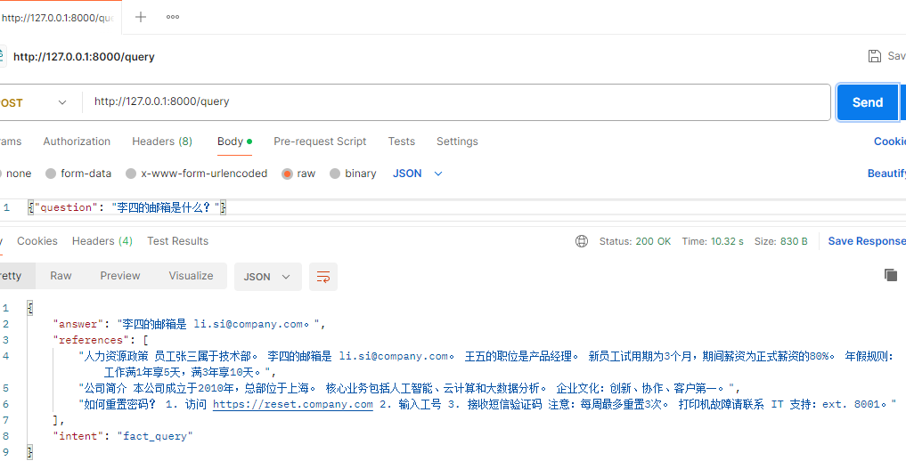

# 多层 RAG 系统（Windows 单机版）

## 技术栈
- 向量库：Qdrant（Windows 二进制）
- 结构化搜索：Elasticsearch 8.13.0（ZIP 版）
- Embedding：BAAI/bge-large-zh-v1.5
- Reranker：BAAI/bge-reranker-large
- LLM：Qwen-Max（DashScope API）
- 框架：FastAPI 自研

## 安装步骤
1. 安装 Python 3.10+
2. 创建虚拟环境并安装依赖：
   ```powershell
   python -m venv .venv
   .venv\Scripts\Activate.ps1
   pip install -r requirements.txt

   # win11 os
   Name: transformers Version: 4.34.1
   Name: huggingface-hub Version: 0.16.4
   Name: sentence-transformers Version: 2.2.2

   # 缺少依赖依次
   python -c "import langdetect; print(langdetect.__file__)"
   # 不成功后，需要 
   pip uninstall langdetect -y
   pip cache purge
   pip install langdetect
   # 验证是否ok
   python -c "from langdetect import detect_langs; print('OK')"
   # 其他依次
   pip uninstall jieba -y
   # nltk
   python -c "import nltk; nltk.download('popular')"
   python -c "import nltk; nltk.download('punkt_tab')"
   python -c "import nltk; nltk.download('averaged_perceptron_tagger_eng')"
   # BAAI/bge-large-zh-v1.5无法下载时，单写个下载文件， $env:HF_ENDPOINT = "https://hf-mirror.com"
   python download_model.py
   

## 下载 Qdrant 和 Elasticsearch（见下文）
## 配置 .env
## 启动服务（两个新窗口）：
  - qdrant\qdrant.exe --config-path qdrant\config.yaml
  - elasticsearch\bin\elasticsearch.bat
  - 导入知识库：(.venv) PS C:\git\ai-rag> python ingest.py
  - 启动 API：(.venv) PS C:\git\ai-rag>python -m uvicorn main:app --host 127.0.0.1 --port 8000

## POSTman 测试
  - 正例
    
  - 反例1
    
  - 反例2
    


